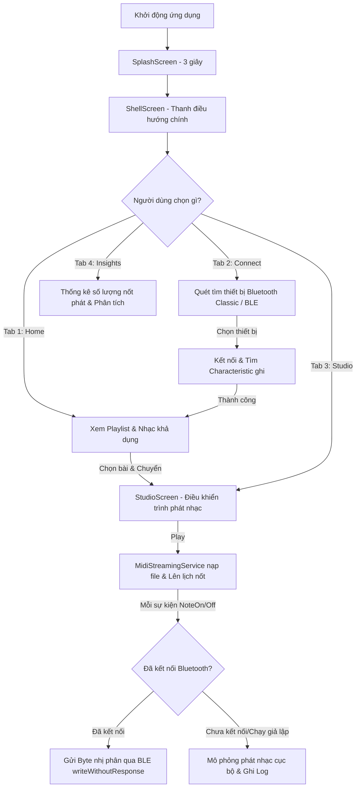

# 🎶 convert_midi — Bộ Truyền Phát Nhạc MIDI Qua Bluetooth (Classic & BLE)

> Một ứng dụng di động được xây dựng bằng **Flutter** hỗ trợ kết nối thiết bị Bluetooth (Bluetooth Low Energy - BLE & Bluetooth Classic) để truyền phát và điều khiển các sự kiện âm nhạc định dạng MIDI theo thời gian thực.

<p align="center">
  
  
  
  
  
</p>

---

## 📌 Mục lục

1. [📖 Tổng quan dự án](#-tong-quan-du-an)
2. [✨ Tính năng chính](#-tinh-nang-chinh)
3. [🔌 Kết nối Bluetooth kép (Dual Bluetooth)](#-ket-noi-bluetooth-kep-dual-bluetooth)
4. [🎼 Xử lý & Phát luồng MIDI (MIDI Streaming)](#-xu-ly--phat-luong-midi-midi-streaming)
5. [🔄 Quy trình hoạt động (Workflow)](#-quy-trinh-hoat-dong-workflow)
6. [🏗️ Kiến trúc & Cấu trúc thư mục](#-kien-truc--cau-truc-thu-muc)
7. [🛠️ Công nghệ & Thư viện sử dụng](#%EF%B8%8F-cong-nghe--thu-vien-su-dung)
8. [🚀 Cài đặt & Khởi chạy](#-cai-dat--khoi-chay)
9. [📄 Giấy phép (License)](#-giay-phep-license)

---

## 📖 Tổng quan dự án

**convert_midi** là ứng dụng di động chuyên dụng cho phép quét, kết nối và truyền tải tín hiệu âm thanh kỹ thuật số MIDI (Musical Instrument Digital Interface) không dây tới các thiết bị âm nhạc hoặc bộ xử lý âm thanh đầu cuối qua giao thức Bluetooth. 

Ứng dụng giúp đơn giản hóa việc chuyển đổi các tệp nhạc `.mid` thành luồng dữ liệu byte truyền phát không dây với độ trễ cực thấp (Low Latency). Thiết bị đầu cuối (ví dụ: Đàn Piano điện, bộ Synthesizer hoặc bộ nhận BLE MIDI) sẽ nhận trực tiếp các sự kiện phím nhạc (Note On, Note Off) và phát ra âm thanh tương ứng.

---

## ✨ Tính năng chính

* 📶 **Quét thiết bị Bluetooth thông minh**: Hỗ trợ quét và phát hiện đồng thời cả thiết bị Bluetooth Classic và BLE (Bluetooth Low Energy).
* 🎹 **Phát luồng MIDI thời gian thực**: Đọc tệp nhạc `.mid` từ assets hoặc bộ nhớ máy, lên lịch phát các sự kiện MIDI (NoteOn, NoteOff) với độ chính xác cao theo mili-giây.
* ⚡ **Bộ đệm gửi dữ liệu chống nghẽn**: Tích hợp một hàng đợi (`Queue`) gửi dữ liệu BLE không chặn để tránh hiện tượng nghẽn luồng truyền tin (packet collision) khi có quá nhiều nốt nhạc phát cùng lúc.
* 🛠️ **Hệ thống điều khiển Studio chuyên nghiệp**: Giao diện Studio cho phép chọn bài hát, xem danh sách nhạc, phát (Play), dừng (Stop) và theo dõi trực quan danh sách nốt nhạc sẽ phát.
* 📊 **Thống kê chi tiết (Insights)**: Biểu đồ và thông số phân tích dữ liệu MIDI đang phát, số lượng nốt nhạc đã truyền tải.
* 🖥️ **Overlay nhật ký nhà phát triển (DevLog Overlay)**: Giao diện trực quan hiển thị logs hệ thống thời gian thực ngay trên màn hình ứng dụng để hỗ trợ debug tín hiệu Bluetooth.
* 🌍 **Hỗ trợ đa ngôn ngữ (Localization)**: Cấu hình sẵn hệ thống dịch đa ngôn ngữ bằng gói `flutter_intl` (mặc định tiếng Việt).

---

## 🔌 Kết nối Bluetooth kép (Dual Bluetooth)

Ứng dụng hỗ trợ cả hai phương thức kết nối tùy thuộc vào phần cứng của thiết bị nhận:

1. **Bluetooth Low Energy (BLE)**:
   - Sử dụng thư viện `flutter_blue_plus`.
   - Kết nối trực tiếp vào dịch vụ truyền phát, tự động tìm kiếm Characteristic hỗ trợ ghi tín hiệu (`write` hoặc `writeWithoutResponse`).
   - Tối ưu hóa tốc độ bằng cách sử dụng chế độ ghi không phản hồi (`withoutResponse: true`) để hạn chế độ trễ dưới 20ms.

2. **Bluetooth Classic**:
   - Sử dụng thư viện `bluetooth_classic`.
   - Phù hợp với các module Bluetooth HC-05/HC-06 hoặc các thiết bị âm thanh Classic truyền thống.

---

## 🎼 Xử lý & Phát luồng MIDI (MIDI Streaming)

Trái tim của ứng dụng nằm ở `MidiStreamingService`:
* **Giải mã nhạc**: Tận dụng thư viện `dart_midi_pro` để phân tích cấu trúc nhị phân của tệp MIDI, bóc tách các track và sự kiện.
* **Đồng bộ hóa Tempo**: Tự động chuyển đổi từ số Tick (đơn vị đo thời gian của MIDI) sang số mili-giây (`ms`) vật lý dựa trên bản đồ nhịp độ (BPM/Tempo map) được cập nhật liên tục từ sự kiện `SetTempoEvent`.
* **Trộn luồng (Track Merging)**: Trộn tất cả các track nhạc của tệp MIDI thành một dòng sự kiện duy nhất được sắp xếp theo thời gian tuyệt đối tăng dần để đảm bảo việc truyền phát đơn giản và đồng bộ.

---

## 🔄 Quy trình hoạt động (Workflow)



---

## 🏗️ Kiến trúc & Cấu trúc thư mục

Dự án áp dụng cấu trúc phân lớp sạch sẽ, kết hợp thiết kế **BaseView / BaseBloc** sử dụng luồng phản xạ dữ liệu (Reactive Streams) của **RxDart** thay vì các Framework quản lý trạng thái cồng kềnh.

### Cấu trúc thư mục `lib/`

```text
lib/
├── common/             # Tài nguyên dùng chung
│   ├── localization/   # Tệp tự động tạo cho dịch ngôn ngữ (LangKey)
│   ├── assets.dart     # Danh mục định nghĩa đường dẫn tệp âm thanh, lottie, ảnh
│   ├── config.dart     # Cấu hình lưu trữ cài đặt ứng dụng
│   ├── globals.dart    # Khởi tạo toàn cục các Service (Bluetooth, MyApp key)
│   └── theme.dart      # Định nghĩa màu sắc (Dark Mode) và typography (SpaceGrotesk, Geist)
│
├── data/               # Tầng dữ liệu & Mạng (Data Layer)
│   ├── local/          # Đọc/ghi SharedPreferences
│   └── network/        # Cấu hình kết nối HTTP (Dio) và API
│
├── domain/             # Tầng nghiệp vụ cốt lõi (Domain Layer)
│   ├── interaction/    # Xử lý các nghiệp vụ logic chung
│   └── repository.dart # Nơi định nghĩa các luồng truy xuất dữ liệu
│
├── libs/               # Các lõi dịch vụ hệ thống chuyên sâu (Services)
│   ├── bluetooth_service.dart     # Wrapper điều khiển quét/kết nối/gửi gói tin Bluetooth Classic & BLE
│   ├── mock_bluetooth_service.dart# Phiên bản mô phỏng để test trên máy ảo (Emulator)
│   ├── midi_streaming_service.dart# Lõi nạp, phân tích và lập lịch gửi tín hiệu MIDI nhị phân
│   └── log_service.dart           # Ghi lại dấu vết hoạt động của kết nối và truyền tín hiệu
│
├── models/             # Định nghĩa cấu trúc dữ liệu chung
│   └── scanned_device.dart # Cấu trúc dữ liệu đại diện cho thiết bị quét được
│
├── presentation/       # Giao diện người dùng (Presentation Layer)
│   ├── base/           # Lớp BaseView và BaseBloc định hình vòng đời màn hình
│   ├── widgets/        # Các thành phần giao diện dùng chung (Custom Scaffold, Navigator, Logs Overlay)
│   └── modules/        # Chia nhỏ màn hình theo Module chức năng độc lập
│       ├── authen_module/     # Chức năng Splash & Khởi chạy ban đầu
│       ├── shell_module/      # Giao diện khung chứa Navigation Bar dưới đáy
│       ├── home_module/       # Màn hình Home, danh sách playlist bài hát
│       ├── bluetooth_module/  # Màn hình quét và cấu hình kết nối Bluetooth
│       ├── studio_module/     # Màn hình Studio điều khiển phát nhạc & tiến độ bài hát
│       └── insights_module/   # Màn hình thống kê dữ liệu phân tích
│
└── main.dart           # Khởi tạo binding Flutter, nạp SharedPreferences và chạy ứng dụng
```

---

## 🛠️ Công nghệ & Thư viện sử dụng

Các thư viện chính được sử dụng trong dự án `convert_midi`:

| Tên thư viện | Phiên bản | Mục đích sử dụng |
| :--- | :--- | :--- |
| **`flutter_blue_plus`** | `^2.3.2` | Quét và trao đổi dữ liệu với các thiết bị Bluetooth năng lượng thấp (BLE). |
| **`bluetooth_classic`** | `^0.0.4` | Quét và truyền luồng dữ liệu song song qua cổng COM Bluetooth truyền thống. |
| **`dart_midi_pro`** | `^1.0.4+2` | Giải mã nhị phân tệp tin MIDI (`.mid`) thành các đối tượng sự kiện Dart. |
| **`rxdart`** | `^0.28.0` | Cung cấp các Stream nâng cao (BehaviorSubject) hỗ trợ cấu trúc BaseBloc phản xạ. |
| **`dio`** | `^5.7.0` | Thư viện HTTP Client nâng cao hỗ trợ kết nối mạng nếu cần đồng bộ hóa bài hát. |
| **`overlay_support`** | `^2.1.0` | Hiển thị các thông báo nhanh (Toast, Notification) tùy biến đè lên giao diện. |
| **`lottie`** | `^3.3.3` | Hiển thị các hoạt ảnh chuyển động vector cao cấp tại màn hình Splash và tải dữ liệu. |
| **`shared_preferences`** | `^2.3.0` | Lưu trữ cấu hình Bluetooth được chọn và cài đặt cá nhân của người dùng. |

---

## 🚀 Cài đặt & Khởi chạy

### Yêu cầu ban đầu
* Đã cài đặt **Flutter SDK (3.11 trở lên)**.
* Thiết bị thật (Android/iOS) bật sẵn Bluetooth để kiểm tra tính năng kết nối BLE.
* Nếu chạy trên giả lập (Emulator), hãy đổi luồng sang `MockBluetoothService` trong [lib/main.dart](file:///Users/mwang/Ứng dụng/convert_midi/lib/main.dart#L24-L26) để tránh crash do thiếu phần cứng Bluetooth thực tế.

### Các lệnh cơ bản
1. **Cài đặt thư viện:**
   ```bash
   flutter pub get
   ```
2. **Khởi chạy ứng dụng:**
   ```bash
   flutter run
   ```
3. **Phân tích cú pháp dự án:**
   ```bash
   flutter analyze
   ```
4. **Build bản cài đặt Android (APK):**
   ```bash
   flutter build apk
   ```

---

## 📄 Giấy phép (License)

Dự án này được phân phối dưới dạng mã nguồn đóng phục vụ cho mục đích phát triển nội bộ. Tất cả các quyền được bảo lưu.

---
*Dự án được xây dựng và đóng gói hoàn thiện bởi **Antigravity AI Assistant** cùng với sự phát triển của **Google DeepMind Team**.*
